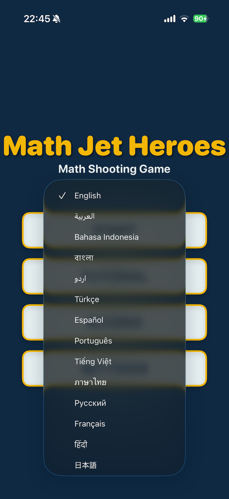
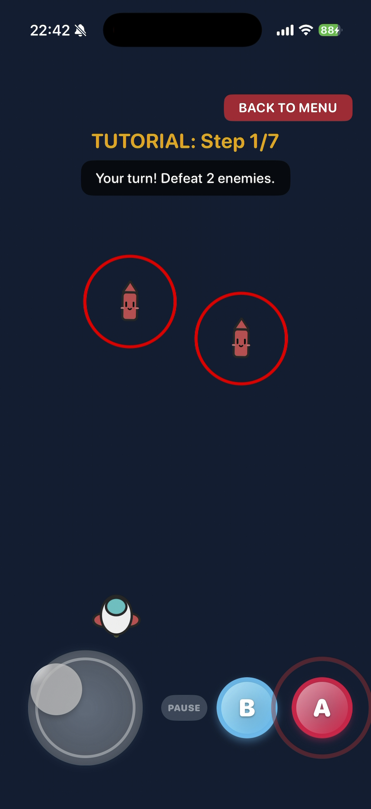
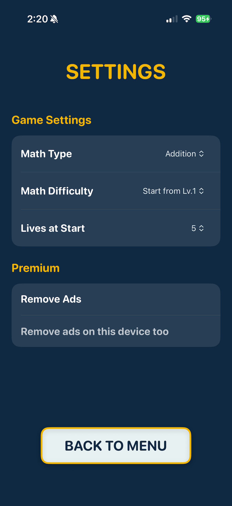
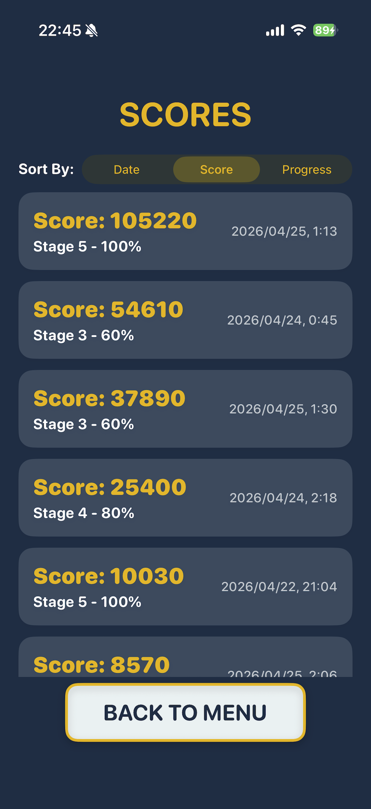

# MathJetHeroes

  

## Overview

MathJetHeroes is an iOS arithmetic shooting game where you pilot a spaceship, solve math problems, and blast through waves of enemies. With retro pixel-art visuals and intuitive touch controls, even elementary school kids can sharpen their math skills while having a blast.

  

## Key Features

- 🎮 **Math Meets Shooting** — To destroy enemies, you must enter the correct answer on the number pad. Right answer = bullets fly. Wrong answer = nothing happens.
- 🚀 **5 Unique Stages** — Journey through a jungle, ocean, snowy mountains, desert, and a glittering city skyline. A powerful boss awaits at the end of each stage.
- ✏️ **Column Arithmetic Display** — Problems appear in a chalkboard-style column format — familiar and intuitive for kids used to pencil-and-paper math.
- ⚙️ **Fully Customizable** — Switch between addition and subtraction, choose difficulty levels 1–5, set starting lives (3–9), and more — tailored to each child's skill level.
- 🌍 **16 Languages Supported** — Available in Japanese, English, Spanish, Arabic, Chinese, and 12 more languages.

## How to Play

  

1. **Move your ship** — Use the D-pad in the bottom-left corner to fly in any direction.
2. **Solve the math problem** — When enemies appear, type the answer using the number pad at the bottom of the screen.
3. **Correct = Fire!** — A correct answer automatically launches bullets. Tap the A button for additional shots.
4. **Defeat the Boss to Clear the Stage** — Collect power-ups, take down regular enemies, and destroy the final boss to complete each stage!

## Stages

  

- **Stage 1 — Jungle River** — Face quirky enemies shaped like pencils, erasers, and rulers. The stage boss is a giant robotic spider: SPIDER CORE.
- **Stage 2 — Sea Archipelago** — Battle fiery orange-themed enemies over a shimmering ocean. The fearsome shark-shaped SHARK CORE awaits as the boss.
- **Stage 3 — Snowy Cloud Realm** — Magical purple-themed enemies haunt an icy snowfield. The tentacled OCTO CORE is the stage boss.
- **Stage 4 — Desert Floating Oasis** — Scorpion-themed enemies modeled after claws, bodies, and tails. The full scorpion boss Scorpion CORE is the final challenge.
- **Stage 5 — Celestial City Ruins** — Encounter robot-part enemies: eyes, mouths, and energy cores. The ultimate machine tyrant THE REGIME CORE Mk-V is the final boss.

  
  

## Weapons & Items

  
  

Enemies drop items when defeated. Use power-ups to upgrade your firepower or survive tough situations.

- 🔫 **Double Shot** — Fire two bullets at once.
- 🌐 **Three Way** — Shoot forward and diagonally at the same time.
- ⚡ **Laser** — Shoot a powerful beam.
- 🚀 **Missile** — Launch homing missiles that track enemies.
- 🛡️ **Barrier** — A shield that blocks one hit of contact damage.
- ❤️ **Heal** — Restore 1 HP.
- ✨ **Invincible** — Become invulnerable for a short time.
- 👥 **Clone** — A clone appears and fights alongside you. (Very Rare)
- **1UP** — Gain an extra life. (Very Rare)

## Ad Enemy System

- During gameplay, special glittering Ad Enemies may appear. Defeating them triggers a short ad, but it rewards you with a debuff effect that weakens the upcoming stage boss!
- An ad-free experience is also available as a paid option.

## Settings

  

- **Operation Type** — Choose addition or subtraction.
- **Difficulty** — 5 levels. Choose escalating difficulty across stages or a fixed level throughout.
- **Starting Lives** — Select from 3, 5, 7, or 9 lives.
- **Language** — Japanese, English, Spanish, Arabic, Simplified Chinese, Korean, and 10 more.

## High Scores

  

Track your top runs by date, score, or stage progress, and aim to clear every stage at 100%.
